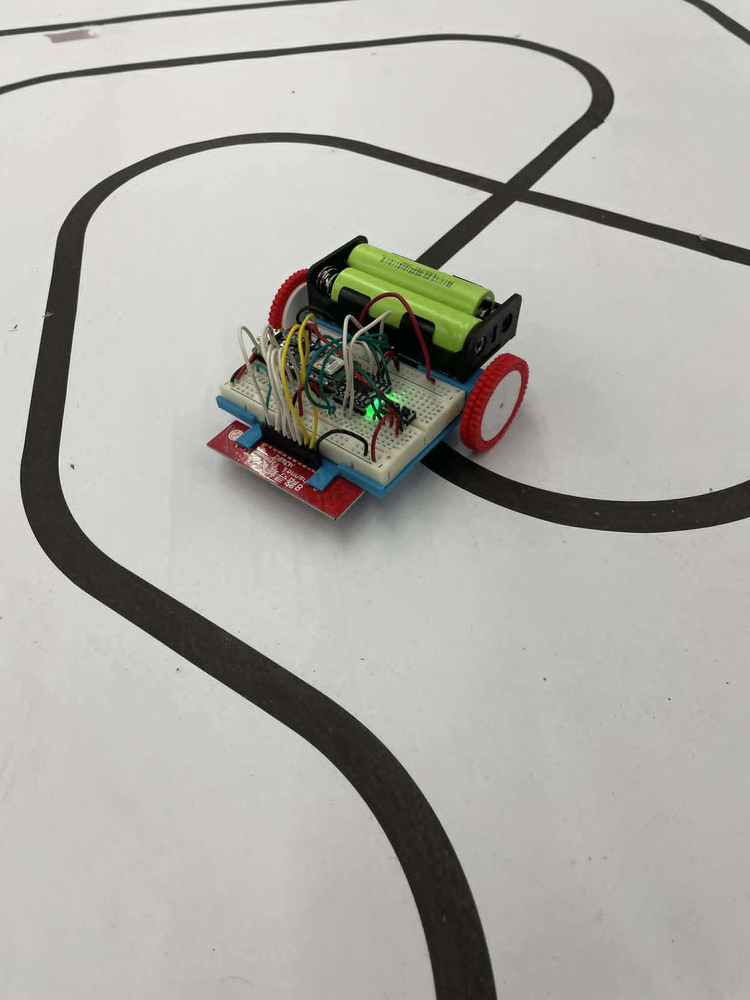

# LineFollower

  
## specifications

microcontroller: esp32 nano

motors: 	JGA12-N20-50 DC-motoren  1/50

h-bridge: DVR8833

sensors: 	8x ir lijn sensor

batteries:	18650 li-ion batterij

wireless communication: esp 32 

distance sensor - motors: 7cm

weight:

speed: 0,35 m/s

